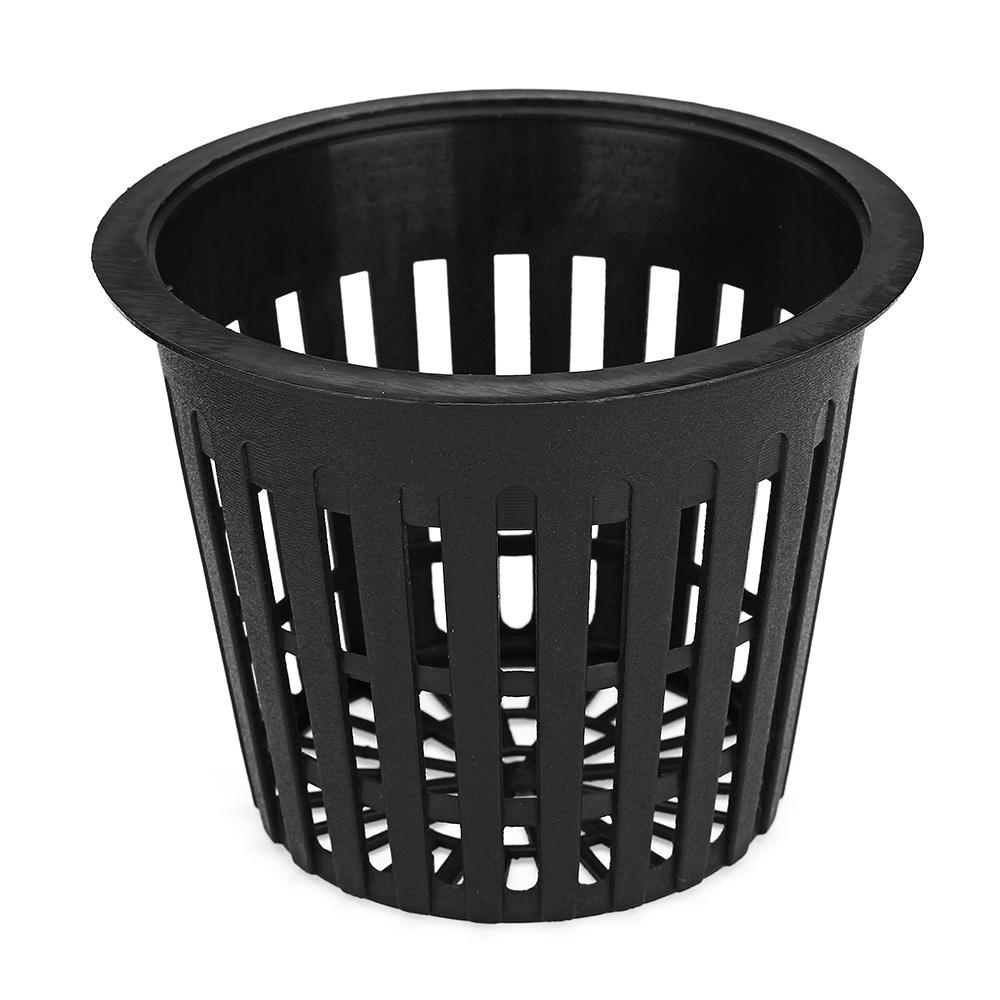
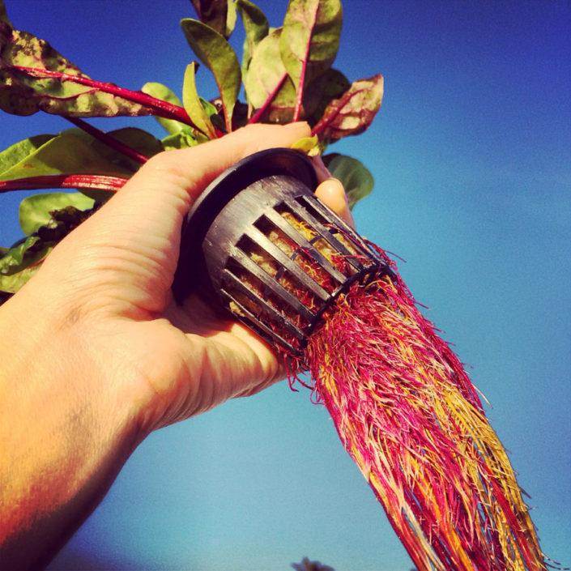
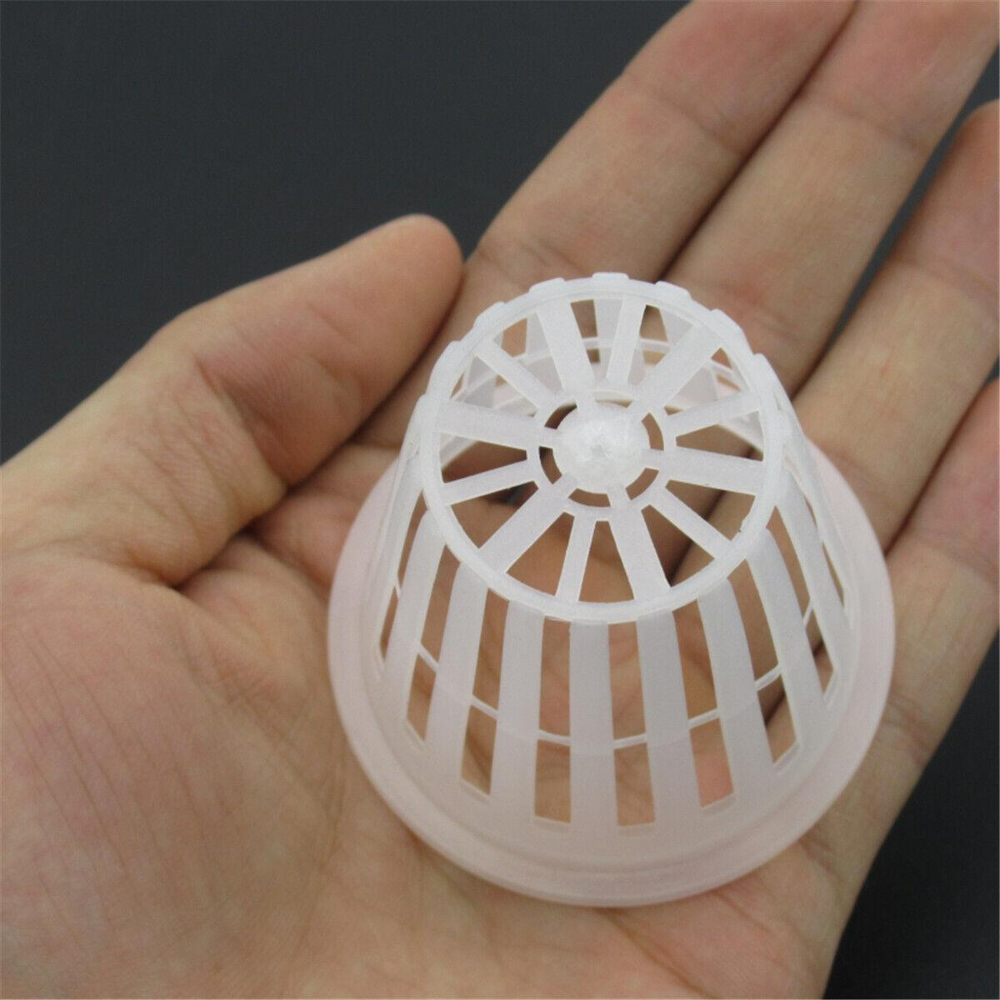

# Collecting Aeroponic Plant Basket Images with Python

Harvesting the Future: Gathering Aeroponic Plant Basket Imagery with Python

## Table of Contents

- [Introduction](#introduction)
- [Technologies Used](#technologies-used)
- [Installation](#installation)
- [Usage](#usage)
- [Project Structure](#project-structure)
- [Contributions](#contributions)
- [License](#license)
- [Author](#author)
- [Acknowledgments](#acknowledgments)
- [Contact](#contact)

## Introduction

Welcome to the "Collecting Aeroponic Plant Basket Images with Python" project! This initiative is focused on the collection of images depicting aeroponic plant baskets using the Python programming language and the "bing-image-downloader" library. The acquired images can serve as valuable training data for the development of pan basket detection models or for various research purposes.

In this README, you will find essential information on how to get started with the image collection process, details about the project's structure, and instructions for contributing to the project. Whether you're interested in using the collected data or contributing to its growth, this documentation will guide you through the necessary steps.

Let's dive in and explore how to harness the power of Python for collecting aeroponic plant basket images efficiently!

## Technologies Used

This project leverages the following technologies:

- **Python**: The primary programming language used for implementing the image collection process.
- **bing-image-downloader**: A Python library used to efficiently download images from Bing search engine based on specific keywords.

These technologies form the foundation of our image collection solution, enabling us to retrieve aeroponic plant basket images effectively.

## Installation

To get started with this project, follow these steps:

1. **Clone the Repository**: If you haven't already, clone this repository to your local machine using the following command:

    ```bash
    git clone https://github.com/julienawonga/aeroponic-plant-basket-images.git
    ```


2. **Python Installation**: Ensure that you have Python installed on your system. If you don't have it installed, you can download it from the [official Python website](https://www.python.org/downloads/).

3. **Install Dependencies**: Navigate to the project directory and install the required dependencies using `pip`:

    ```bash
    pip install -r requirements.txt
    ```

   This command will install the necessary libraries, including "bing-image-downloader," for the project.

With these steps completed, you're now ready to use the project for collecting aeroponic plant basket images.

## Usage

To collect aeroponic plant basket images, follow these steps:

1. Open the `scrapper.py` file in your preferred code editor.

2. Edit the file and specify the keywords for which you want to collect images. You can do this by modifying the `search_terms` variable at the beginning of the script:

    ```python
    search_terms = ["aeroponic plant basket", "aeroponic gardening", "hydroponic planters"]
    ```

   Replace the example keywords with the ones relevant to your image collection.

3. Save the changes to `scrapper.py`.

4. Run the `scrapper.py` script to initiate the image collection process:

    ```bash
    python scrapper.py
    ```

   This script will use the "bing-image-downloader" library to fetch images based on your specified keywords.

5. Once the collection process is complete, you will find the downloaded images in separate folders based on the provided keywords.

6. To consolidate all the collected images into a single folder, you can use the `merge.py` script. Open the `merge.py` file and specify the source directory containing the downloaded images and the output directory where you want the merged images to be stored:

    ```python
    source_directory = "downloaded_images"
    output_directory = "merged_images"
    ```

   After configuring these paths, run the `merge.py` script:

    ```bash
    python merge.py
    ```

   The script will merge all the images into the specified output directory.

You now have successfully collected and organized aeroponic plant basket images for your project or research purposes. Enjoy using the collected data!

## Project Structure

The project directory is structured as follows:

- **scrapper.py**: This script is responsible for collecting images based on specified keywords using the "bing-image-downloader" library.

- **merge.py**: Use this script to merge all the collected images into a single directory for easier access and organization.

- **downloaded_images/**: This directory contains subdirectories named after the keywords you provided in the `scrapper.py` script. Each subdirectory contains the images collected for the corresponding keyword.

- **merged_images/**: After running the `merge.py` script, this directory will store all the collected images merged into a single folder.

- **README.md**: The README file you are currently reading, providing essential information about the project.

The clear project structure helps keep your image collection process organized and efficient. You can use the collected images or further customize the project as needed.


## Contributions

Contributions to this project are welcomed and encouraged! If you'd like to contribute, please follow these steps:

1. **Fork the Repository**: Start by forking this repository to your GitHub account. You can do this by clicking the "Fork" button at the top right of this repository page.

2. **Clone the Forked Repository**: Clone your forked repository to your local machine.

    ```bash
    git clone https://github.com/julienawonga/aeroponic-plant-basket-images.git
    ```
3. **Create a New Branch**: Create a new branch for your contribution work.

    ```bash
    git checkout -b feature/new-feature
    ```

   Replace `feature/new-feature` with an appropriate branch name.

4. **Make Changes**: Make the desired changes or improvements to the project.

5. **Commit Changes**: Commit your changes with a descriptive commit message.

    ```bash
    git commit -m "Add new feature: [Feature Name]"
    ```

6. **Push Changes**: Push your changes to your forked repository.

    ```bash
    git push origin feature/new-feature
    ```

7. **Create a Pull Request**: Go to the original repository on GitHub and create a pull request. Provide a clear and detailed description of your changes in the pull request.

Once your pull request is submitted, it will be reviewed, and your contributions will be considered for inclusion in the project.

Thank you for your interest in contributing to this project!

## License

This project is distributed under the terms of the [MIT License](LICENSE).

The MIT License is a permissive open-source license that allows you to use, modify, and distribute this project for various purposes, both personal and commercial. However, it comes with no warranty or liability.

For more details about the MIT License, please review the [LICENSE](LICENSE) file in the project repository.

Feel free to use, modify, and share this project in accordance with the terms of the MIT License.


## Author

This project was created and is maintained by:

- **Julien Awon'ga**

You can connect with the author via:

- Email: julienawon@outlook.com
- LinkedIn: [julienawonga](https://www.linkedin.com/in/julienawonga/)


## Acknowledgments

We would like to express our gratitude to the following individuals and projects for their contributions, inspiration, and support:

- The author of the "bing-image-downloader" library for providing a valuable tool that made image collection easier.
Your contributions and open-source initiatives are greatly appreciated and have played a significant role in the success of this project.

## Contact

If you have any questions, suggestions, or feedback related to this project, please don't hesitate to reach out. You can contact the author through the following means:

- Email: [julienawon@outlook.com](mailto:julienawon@outlook.com)
- LinkedIn: [julienawonga](https://www.linkedin.com/in/julienawonga/)

Feel free to connect or send a message, and we'll get back to you as soon as possible. Your input and inquiries are important to us.

## Sample Images



